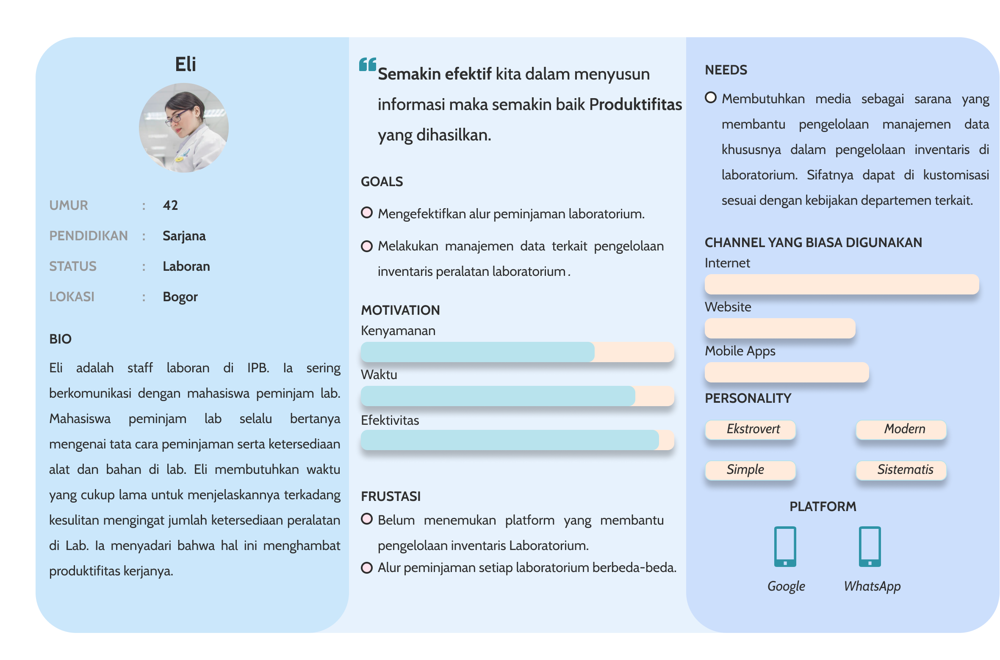
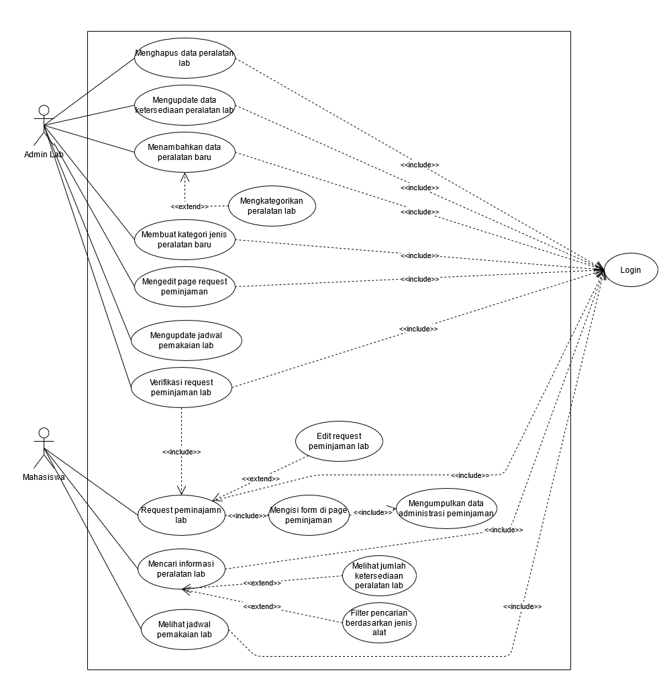
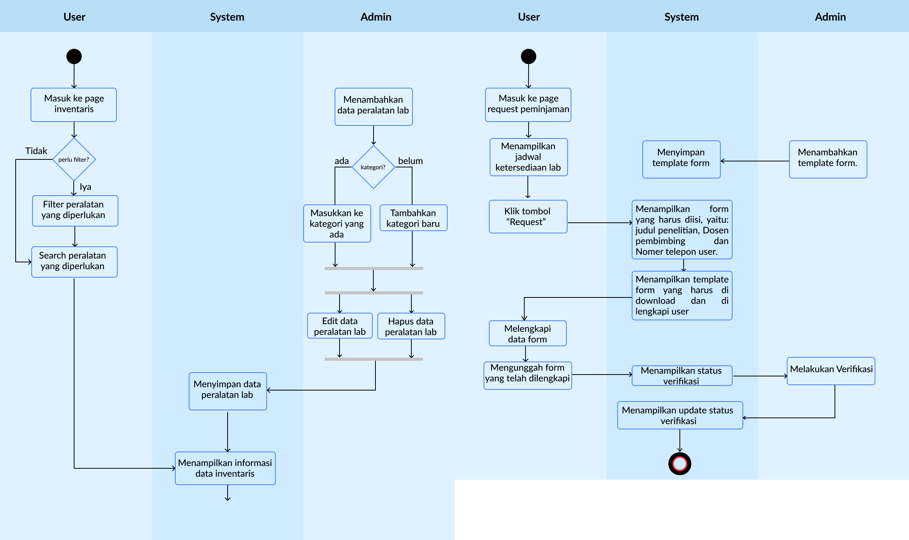
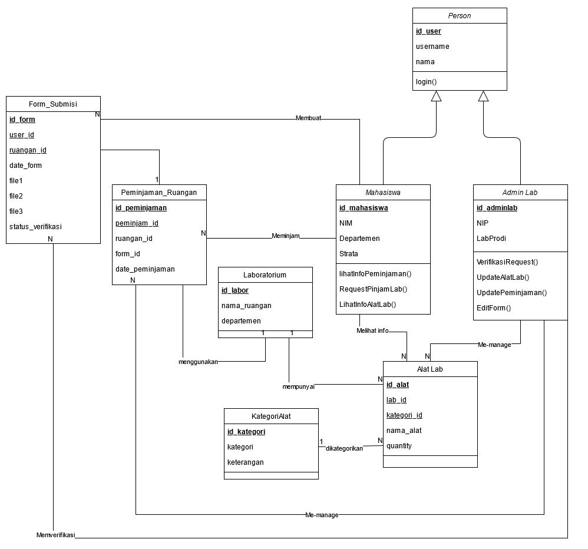
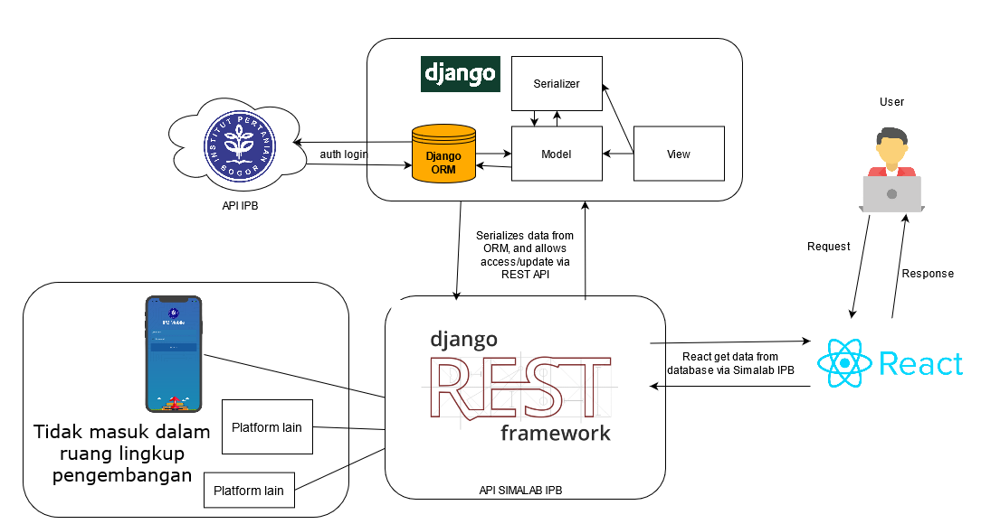

# SIMALAB IPB
Tugas Akhir KOM322-PSBO P1 - Sistem Manajemen Lab IPB

---

## Deskripsi Aplikasi
Simalab IPB merupakan sebuah sistem manajemen lab internal yang membantu penanggung jawab dalam dalam mengelola laboratorium, serta mahasiswa IPB yang ingin menggunakan lab untuk kebutuhan penelitian. Dalam input datanya, Simalab IPB menggunakan API IPB, untuk mendapatkan data pengguna mencakup pegawai dan mahasiswa untuk SSO. Sedangkan data-data inventaris dan kegiatan lab akan diinput mandiri oleh admin lab. Data tersebut kemudian akan disimpan pada sebuah database baru Simalab IPB, dan dikembangkan sebagai API Simalab.
Output dari Simalab IPB diharapkan dapat membantu aktivitas dan manajemen lab IPB khususnya dalam melayani peminjaman laboratorium, memantau ketersediaan alat laboratorium, melakukan rekap bahan dan alat yang tersedia, dan mengelola jadwal pemakaian laboratorium.

---

## Spesifikasi teknis lingkungan pengembangan

**Software**
- Google Cloud Product VM Instances
    - n1-standard-2 (2 vCPUs, 7.5 GB memory)
    - asia-southeast2-a 
    - Ubuntu 20.04.2.0 LTS
- docker-compose v1.25.2
- Docker v19.03.5
- Windows 10 64 bit
- Sublime Text v3.2.2    

**Hardware**
- i5-1135G7 @ 2.40 Ghz ( 8 CPUs)
- 8GB RAM

**Tech Stack**

- Frontend  : NextJS dan Material UI for React
- Backend   : Django 3.2.4 , djangorestframework 3.12.4

---

## User Research & Analysis

**Desk Research**

   Kami melakukan literasi terhadap penelitian terdahulu sesuai dengan permasalahan yang ingin kami solve. Selain itu, research kami awali dengan melakukan observasi terhadap kemungkinan masalah yang dapat kami selesaikan. Dari beberapa topik yang kami kumpulkan, kami memilih untuk memfokuskan topik mengenai alur peminjaman laboratorium di IPB, khususnya pada laboratorium FMIPA basah. 
Fokus kami adalah menggali lebih dalam mengenai hal yang dibutuhkan oleh para laboran khususnya untuk membantu efektifitas kinerja mereka. Setelah literasi dilakukan kami mendapatkan beberapa asumsi terkait, yakni mengenai prosedur peminjaman laboratorium.

**In Depth Interview**

   Kami menetapkan sampel yakni **3** orang tendik laboran, masing-masing merupakan laboran dari laboratorium kimia, laboratorium biologi dan laboratorium biokimia. Kami mengumpulkan kontak laboran tersebut melalui literasi pada web departemen terkait di IPB lalu menanyakan kontak pada rekan mahasiswa yang berkuliah di departemen terkait. Kami melakukan interview by phone ataupun validasi melalui chat dengan laboran selaku narasumber.

Berikut tujuan dari interview yang kami lakukan:
1. Mengetahui alur prosedur peminjaman dan pemakaian lab pada departemen terkait.
2. Mengetahui cara laboran melakukan manajemen laboratorium pada departemen terkait.
3. Mengetahui kendala laboran melakukan manajemen laboratorium departemen terkait.

    Setelah kami melakukan interview dengan tujuan untuk menggali pain yang dirasakan oleh laboran. Kami mendapatkan insight bahwa **2 dari 3** laboran yang kami wawancarai sepakat bahwa mereka mengalami kesulitan dalam menjelaskan keterangan dari alat-alat yang tersedia di lab dikarenakan jumlahnya sangat banyak, dan **ketiganya** berpendapat bahwa belum tersedia manajemen data alat dan bahan Lab secara digital di laboratorium mereka, maupun terpusat dari IPB University.  Mayoritas kegiatan peminjaman lab pun diawali dengan pengisian form yang disesuaikan dengan aturan departemen masing-masing.

**User Story**

   Sebagai seorang laboran di IPB saya ingin sebuah wadah yang dapat membantu saya menginformasikan **keterangan dan ketersediaan stok** bahan dan peralatan di laboratorium. Serta membantu request **peminjaman lab**. Agar para mahasiswa dapat melakukan peminjaman lab secara terstruktur, serta mahasiswa dapat mengetahui informasi ketersediaan alat bahan serta peralatan di lab tanpa harus bertanya kepada saya terlebih dahulu.

**Persona**

**Solusi**

   Menilik dari pengamatan kami mengenai fakta terkait alur peminjaman serta Manajemen data pada laboratorium di IPB University, khususnya pada laboratorium FMIPA basah (Kimia, Biologi dan Biokimia ). Kami mendapatkan beberapa chance untuk melakukan sebuah perbaikan dalam sisi manajemen penyimpanan data dan keefektifan alur peminjaman lab. Adapun rancangan sistem yang kami tawarkan, memiliki fitur berupa :
1. Melakukan pendaftaran request peminjaman laboratorium.
2. Melakukan pencarian alat dan bahan yang tersedia di laboratorium terkait
3. Melihat jumlah stok alat dan bahan yang tersedia.

Tentunya sistem ini akan disesuaikan dengan kebutuhan pada lab departemen terkait dan manajemen data laboratorium dikelola oleh admin yang bersangkutan.

---

## Sistem Design
 **Use case diagram**

 

 **Activity diagram**

  

[Link to Activity Diagram on figma](https://www.figma.com/file/a7teoauijvA6np4MsRLbMR/PSBO-Kelompok-5?node-id=5%3A12)

 **Class diagram**

 

 **Entity Relationship Diagram**

[Link to Entity Relational](ipb.link/psbo-entity-kel5)

 **Arsitektur sistem**

 

---

## Implementation and Unit Testing

**Konsep OOP yang Digunakan**

   aaaaaaaaaaaaaaaaaaaaaaaaaaaaaaaaaaaaaaaaaaaaa

**Tipe Desain Pengembangan**

   aaaaaaaaaaaaaaaaaaaaaaaaaaaaaaaaaaaaaaaaaaaaa

**Implementasi SIMALAB API**

   aaaaaaaaaaaaaaaaaaaaaaaaaaaaaaaaaaaaaaaaaaaaa

**Fitur dan Tampilan Aplikasi**

   aaaaaaaaaaaaaaaaaaaaaaaaaaaaaaaaaaaaaaaaaaaaa

---

## Integration and System Testing

---

## Deployment

---

## Saran

---

## Developer
<table>
    <thead>
        <tr>
            <th></th>
            <th>Nama</th>
            <th>Nim</th>
            <th>Role</th>
        </tr>
    </thead>
    <tbody>
        <tr>
            <td>1</td>
            <td>Aldi Oktaviana Hidayat</td>
            <td>G64180005</td>
            <td>Frontend</td>
        </tr>
        <tr>
            <td>2</td>
            <td>Bintang Fikriguska</td>
            <td>G64180024</td>
            <td>Backend</td>
        </tr>
        <tr>
            <td>3</td>
            <td>Rafiandi Ammar Putra</td>
            <td>G64180072</td>
            <td>UI Designer,Front end</td>
        </tr>
        <tr>
            <td>3</td>
            <td>Annisa Faradila</td>
            <td>G64180074</td>
            <td>UX Research , UI Designer</td>
        </tr>
        <tr>
            <td>3</td>
            <td>Alvin Ferdiansyah</td>
            <td>G64180079</td>
            <td>Backend, Project Manager</td>
        </tr>
    </tbody>
</table>
